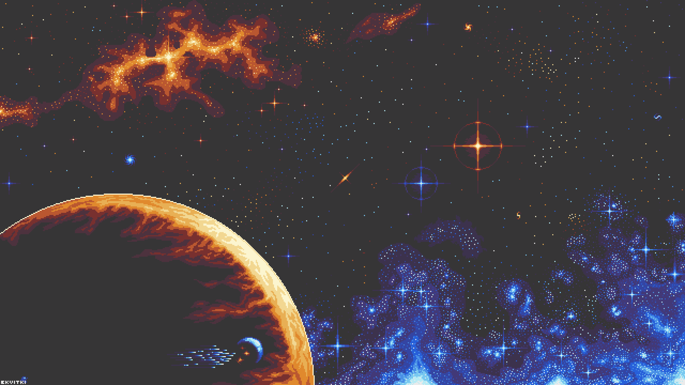

# 👾 No Name Game 👾

----
## 🔎 Tabla de Contenidos 🔎
- [Información del Proyecto](https://github.com/ze3ck/NoNameGame?tab=readme-ov-file#-informaci%C3%B3n-del-proyecto-)
- [Equipo de Trabajo](https://github.com/ze3ck/NoNameGame?tab=readme-ov-file#-equipo-de-trabajo-)
    - [Desarrolladores](https://github.com/ze3ck/NoNameGame?tab=readme-ov-file#-desarrolladores-)
    - [Diseño Gráfico y Arte](https://github.com/ze3ck/NoNameGame?tab=readme-ov-file#-dise%C3%B1o-gr%C3%A1fico-y-arte-)
- [Otros](https://github.com/ze3ck/NoNameGame/blob/main/README.md#-otros-)
----
## 📖 Información del Proyecto 📖
- **Estado:** _No iniciado_
- **Título:** No Name Game - _Provisional_
- **Género:** _Por definir_
- **Estilo:** 2D Pixel Art
----
## 👤 Equipo de Trabajo 👤
### 👨‍💻 Desarrolladores 👨‍💻
- Pablo Gonzales 
- [**Soqus:**](https://github.com/soqus) Daniel Caro 
- [**Sky_:**](https://github.com/SkyZerafeen) Esteban Garces 
- [**Ze3ck:**](https://github.com/ze3ck) Bastian Leyton 
### 🎨 Diseño Gráfico y Arte 🎨
- [**Shino_Hatake:**](https://github.com/Shino-Hatake) Sergio Jaramillo 
----
## 🌌 Otros 🌌
----
